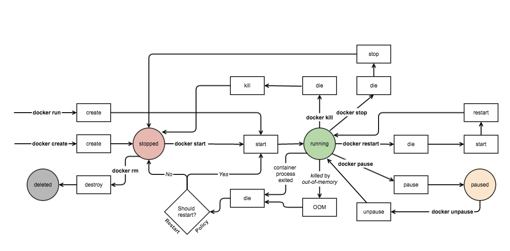

## Docker Event State


### 创建容器
基于“镜像文件”，镜像文件有默运行的程序。

运行的容器内部必须有一个工作前台的运行的进程

>docker的容器通常仅为运行一个程序。如果想在容器内运行多个程序，一般需要提供一个管控程序，例如supervised。

### 制作镜像

#### 基于容器制作


制作nginx的容器镜像，在容器中完成操作后制作

``` bash
docker commit -a "AUTHOR_NAME" -C 'CMD ["/usr/sbin/nginx"]' DOCKER_NAME  

# 运行
docker run --name DOCKER_NAME -d REPOSITORY:TAG
```
将镜像文件导出为tar文件

```bash
docker save -o /root/nginx-v0.1.0.tar INAME_ID

#导入
docker loader -i /root/nginx-v0.1.0.tar
```


#### 基于镜像制作
编辑一个Dockerfile，而后根据此文件制作

```bash
FROM repository:tag
MAINTAINER author <author@mail.com>
COPY dir1 dir2
ADD http://host/resource /dir/
VOLUME /data/html
EXPOSE 80/tcp

ENV var_key var_value
ADD ${var_key} /dir/

RUN command_1 \
    && command_2 \
    && command_3
    
CMD ["excute_command","param1","param2"]

ONBUILD (基于此镜像触发此命令)
```

### Docker网络


