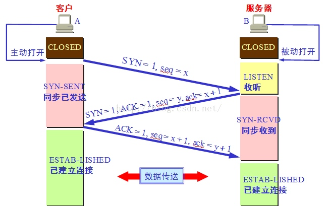
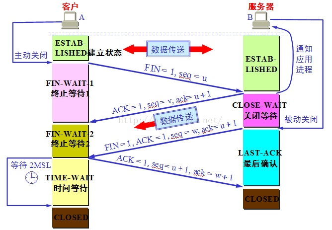

## TCP建立连接

1. Client: 向server发送 SYN 包，表示请求建立连接，进入 SYN_SENT 状态；
2. Server: 接收来自client的 SYN 包，发送 SYN/ACK 包，代表client->server单向tcp连接已经建立， 进入 SYN_RCVD 状态；
3. Client: 接收到来自server的 SYN/ACK 包，发送给server ACK 包，进入 Established 状态；
4. Server: 收到client的 ACK 包，代表 server->client 的单向tcp连接也建立，此时进入 Established 状态；

### 为什么需要第三次握手?
     还要再发送一次确认是为了，防止已失效的连接请求报文段突然又传到了B，因而产生错误。
     已失效的报文段：正常情况下：A发出连接请求，但因为丢失了，故而不能收到B的确认。于是A重新发出请求，然后收到确认，建立连接，数据传输完毕后，释放连接，A发了2个，一个丢掉，一个到达，没有“已失效的报文段”
     但是，某种情况下，A的第一个在某个节点滞留了，延误到达，本来这是一个早已失效的报文段，但是在A发送第二个，并且得到B的回应，建立了连接以后，这个报文段竟然到达了，于是B就认为，A又发送了一个新的请求，于是发送确认报文段，同意建立连接，假若没有三次的握手，那么这个连接就建立起来了（有一个请求和一个回应），此时，A收到B的确认，但A知道自己并没有发送建立连接的请求，因为不会理睬B的这个确认，于是呢，A也不会发送任何数据，而B呢却以为新的连接建立了起来，一直等待A发送数据给自己，此时B的资源就被白白浪费了。但是采用三次握手的话，A就不发送确认，那么B由于收不到确认，也就知道并没有要求建立连接。
     总之就是：第三次握手，是为了让B知道连接建立了。

## tcp断开连接

1. client: 主动调用close()，发送 FIN 包，此时client就"主动关闭"端，进入 FIN_WAIT_1 状态；
2. Server: server自然成为"被动关闭"端，收到来自client的 FIN 包，发送 ACK 包，代表client->server单向tcp连接已经关闭，进入 CLOSE_WAIT 状态；
3. Client: 接收到来自server的 ACK 包，啥都不做，client->server单向的tcp连接已经断开，不能再发送应用层数据，进入 FIN_WAIT_2 状态；
4. Server: server端给client端发送 FIN 包，代表准备关闭server->client的tcp连接，server进入LAST_ACK 状态；
5. Client: 收到来自server的 FIN 包，发送 ACK 包，此时进入 TIME_WAIT 状态；
6. Server: 收到Client的 ACK 包，就进入closed状态，Server端此次socket tcp连接完全端口；
7. Client: 持续TIME_WAIT状态"一段时间"；

## 理解TIME_WAIT
理解了上面的原理之后，接着就是正式介绍TIME_WAIT。TIME_WAIT的时间大多数情况下都是2倍的MSL（Maximum Segment Lifetime），MSL是一个数据包在网络上能生存的最长生命周期，一旦超过MSL的包就会被丢弃。

从上面可以看到，TIME_WAIT是“主动关闭”端的最后一个状态，引入TIME_WAIT的原因有:

1. 确保“主动关闭”端最后发出的 ACK 到达“被动关闭”端
2. 保证新tcp连接和老tcp连接不会干扰

### 原因1: 确保"主动关闭"端最后发出的 ACK 到达"被动关闭"端
看上面tcp断开连接的图，由client主动调用close()，发出FIN包，然后接收到server的ACK/FIN包，客户端最后发一个FIN包，进入TIME_WAIT。

设想一下，如果没有TIME_WAIT，client端发送最后的FIN包后里面关闭连接，如果由于网络原因，最后发出的FIN包没有顺利到达server(此时的server一直处于LAST_ACK状态等待最后FIN)，server长时间没有接收到FIN包，会认为之前由server发出的ACK/FIN包client没有收到，server会重新发送一个ACK/FIN包，这时候client收到ACK/FIN包，发现端口已经关闭，协议栈直接回复RST包，导致server端接收到RST包报错，影响应用进程。

所以 TIME_WAIT 的作用可以保证最后的ACK包必然能到达对方，确保最后的连接正常端口。也解释了TIME_WAIT时间是2*MSL的原因。

### 原因2: 保证新tcp连接和老tcp连接不会干扰

End Point2发送FIN包后，没有进入TIME_WAIT状态，此时新的tcp请求又来了，而且src_ip，src_port，dst_ip，dst_port都是一样的，新的连接建立TCP请求后，老的连接包可能会干扰新连接的包，导致乱序。所以引入TIME_WAIT，2*MSL能让老连接的包彻底在网络中消失，保证新连接绝对干净。

[原文链接](http://www.firefoxbug.com/index.php/archives/2795/)

