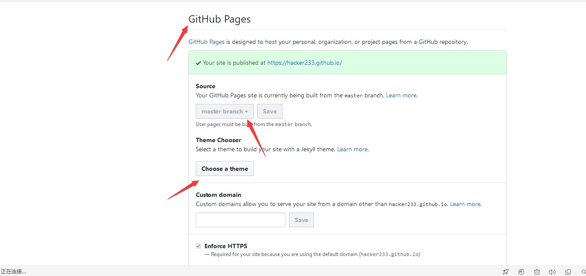

# 自动化部署Hexo博客

>什么是 Hexo？
>>Hexo 是一个快速、简洁且高效的博客框架。Hexo 使用 Markdown（或其他渲染引擎）解析文章，在几秒内，即可利用靓丽的主题生成静态网页。

本文探讨的是：如何优美的在本地写一篇博客并自动化部署到服务器上。

## 预备备
在整个环境搭建过程中，你需要有以下几样环境：

1. 云主机      【阿里云、腾讯云服务器】
2. github账户     【拥有一个github账号】

云主机：部署博客网站
github：部署博客网站和备份博客数据


>有了云主机部署博客网站为什么还要github部署博客？
>>如果云主机突然因为什么原因访问不了了，此时又想查看自己的博客内容，这时候怎么办？我们可以同时将博客部署到云主机和github上

## 安装Hexo
安装Hexo没有比官方更加详细的了，请移步 --> [Hexo官方安装教程](https://hexo.io/zh-cn/docs/index.html)

## 将github作为个人博客网站
创建一个以xxx.github.io命名的git仓库（xxx代表你的github用户名）

进入settings，往下拉，找到GitHub pages设置界面

选择source之后记得Save。

## 云主机配置
### 首先创建git用户

``` bash
$ adduser git
```

### 以git用户创建裸仓库

``` bash
$ su - git
$ git init --bare blog.git
```

### 使用git钩子同步网站根目录

post-receive这个钩子，当git有收发的时候就会调用这个钩子。

``` bash
$ vim ~/blog.git/hooks/post-receive

#!/bin/bash
GIT_REPO=/home/git/blog.git	//仓库地址
TMP_GIT_CLONE=/tmp/hexo
PUBLIC_WWW=/path/www	//这里web服务器根目录
rm -rf ${TMP_GIT_CLONE}
git clone $GIT_REPO $TMP_GIT_CLONE
rm -rf ${PUBLIC_WWW}/*
cp -rf ${TMP_GIT_CLONE}/* ${PUBLIC_WWW}
```
>记得给post-receive文件给与可执行权限`chmod +x post-receive`

nginx配置：

``` shell
server {
	listen 80;
	server_name The_Domain_Name;
	rewrite ^(.*)$ https://$host$1 permanent;
}
server {
	listen 443 ssl;
	root   网站根目录;
	server_name  The_Domain_Name;

	##
	# SSL Settings
	##
	ssl on;
	ssl_certificate crt地址;
	ssl_certificate_key key地址;
	ssl_session_timeout 5m;
	ssl_session_cache shared:SSL:10m;
    ssl_protocols TLSv1 TLSv1.1 TLSv1.2;
	#按照这个套件配置
	ssl_ciphers ECDHE-RSA-AES128-GCM-SHA256:HIGH:!aNULL:!MD5:!RC4:!DHE;
	ssl_prefer_server_ciphers on;
	location / {
		index  index.html index.htm;
	}
}
```

## 将博客数据备份到github
为什么要将数据备份？因为hexo的deploy只是将我们写的博客渲染成静态文件（也就是html）发布到云主机（或者是github），而我们的博客文件只存在于本地，如果本地数据丢失（笔记本坏了），那么我们写的博客文件就丢失了。

### 本地hexo博客仓库与远端git仓库绑定
首先在github下创建保存Hexo源博客文件的git仓库blog，名称与本地Hexo保持一致。

然后将远端仓库添加到本地

``` bash
# 进入本地Hexo文件夹
$ git init

# 添加远端仓库
 git remote add origin https://github.com/XXX/blog.git

# vim .gitignore
*.log
node_modules/
public/
.deploy*/
```
>修改.gitignore文件（如果没有请手动创建一个），在里面加入*.log 和 public/ 以及.deploy*/。因为每次执行hexo generate命令时，上述目录都会被重写更新。因此忽略这两个目录下的文件更新，加快push速度。

### 完成自动化备份
我们可以通过监听Hexo的deployAfter事件，待上传完成之后自动运行Git备份命令，从而达到自动备份的目的。

#### 安装shelljs模块

``` shell
npm install --save shelljs
```

#### 编写自动化备份脚本
在Hexo根目录的scripts文件夹下新建一个autoDeploy.js文件,添加以下内容：

``` shell
require('shelljs/global');

try {
	hexo.on('deployAfter', function() {//当deploy完成后执行备份
		run();
	});
} catch (e) {
	console.log("产生了一个错误<(￣3￣)> !，错误详情为：" + e.toString());
}

function run() {
	if (!which('git')) {
		echo('Sorry, this script requires git');
		exit(1);
	} else {
		echo("======================Auto Backup Begin===========================");
		cd('/Users/caijun/hexo/blog');    //此处修改为Hexo根目录路径
		if (exec('git add --all').code !== 0) {
			echo('Error: Git add failed');
			exit(1);

		}
		if (exec('git commit -am "Form auto backup script\'s commit"').code !== 0) {
			echo('Error: Git commit failed');
			exit(1);

		}
		if (exec('git push origin master').code !== 0) {
			echo('Error: Git push failed');
			exit(1);

		}
		echo("==================Auto Backup Complete============================")
	}
}
```


## 最后配置本地Hexo
打开Hexo的配置文件_config.yml

添加如下两个仓库：

1. 云主机仓库
2. github仓库

``` yml
deploy:
- type: git
  repo: git@domain_name:/home/git/blog.git  # 将本地hexo部署到云主机
- type: git
  repo: https://github.com/xxx.github.io   #将本地hexo部署到github 博客
  branch: master
  
```
>注意：
>在hexo deploy发布完成后通过监听hexo的deployAfter事件，会自动执行我们上一小节添加的autoDeploy.js文件。

所以，当我们执行命令：

``` shell
$ hexo clean && hexo g && hexo d
```

hexo会做三件事情：

1. 将静态博客文件（html）部署到云主机
2. 将静态博客文件（html）部署到github
3. 将源博客数据部署到github

在发布之后，你可以通过你的博客网站和xxx.github.io浏览你的博客，并且可以git clon 你的博客数据到本地，再也不用担心数据丢失。

>参考：
>>1.[备份Hexo博客源文件](https://notes.doublemine.me/2015-04-06-%E5%A4%87%E4%BB%BDHexo%E5%8D%9A%E5%AE%A2%E6%BA%90%E6%96%87%E4%BB%B6.html)
>>2.[自动备份Hexo博客源文件](https://notes.doublemine.me/2015-07-06-%E8%87%AA%E5%8A%A8%E5%A4%87%E4%BB%BDHexo%E5%8D%9A%E5%AE%A2%E6%BA%90%E6%96%87%E4%BB%B6.html)
>>3.[Git服务器搭建并自动部署Hexo到云主机与Github](http://www.huyidada.com/2017/08/26/HexoSyncGit/#%E8%87%AA%E5%8A%A8%E5%8C%96%E9%83%A8%E7%BD%B2)


